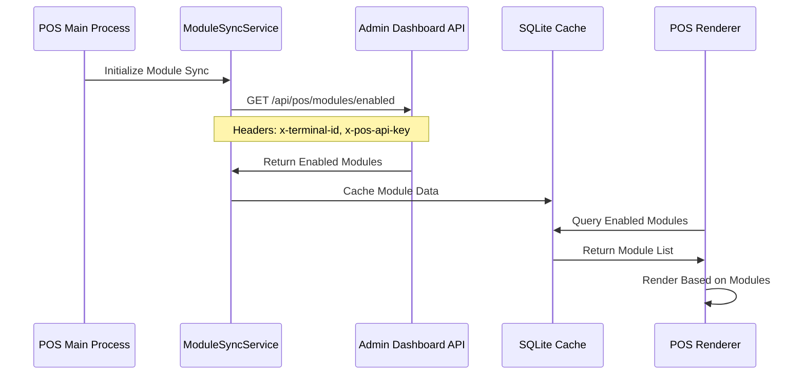

# The Small POS System

**Offline-First Point of Sale with Dynamic Module-Based UI**

Electron-based desktop POS application with offline-first capabilities, real-time synchronization with Supabase, and **dynamic UI based on purchased modules**. Built for Windows with React + TypeScript, featuring local SQLite database with bidirectional cloud sync.

---

## 🏗️ Platform Role

The POS System is a **dynamic, module-driven** application that adapts its UI and capabilities based on modules purchased by the organization:

```
┌─────────────────────────────────────────────────────────────────────────┐
│                      POS SYSTEM ARCHITECTURE                            │
├─────────────────────────────────────────────────────────────────────────┤
│                                                                         │
│   ┌───────────────────────────────────────────────────────────────┐    │
│   │                    POS SYSTEM (Electron)                      │    │
│   │                                                               │    │
│   │   ┌─────────────────┐    ┌─────────────────────────────────┐ │    │
│   │   │  Main Process   │    │      Renderer Process           │ │    │
│   │   │  (Node.js)      │    │      (React 19)                 │ │    │
│   │   │                 │    │                                 │ │    │
│   │   │ • SQLite DB     │    │ • useAcquiredModules()         │ │    │
│   │   │ • ModuleSyncSvc │    │ • Dynamic Order Types          │ │    │
│   │   │ • Sync Queue    │◀──▶│ • Module-Based Navigation      │ │    │
│   │   │ • Auth Service  │    │ • Conditional Features         │ │    │
│   │   │ • IPC Handlers  │    │ • Glassmorphism UI            │ │    │
│   │   └─────────────────┘    └─────────────────────────────────┘ │    │
│   └───────────────────────────────────────────────────────────────┘    │
│            ▲                                                           │
│            │ Module Sync                                               │
│            │ /api/pos/modules/enabled                                  │
│            ▼                                                           │
│   ┌───────────────────────────────────────────────────────────────┐    │
│   │               ADMIN DASHBOARD (API Provider)                  │    │
│   └───────────────────────────────────────────────────────────────┘    │
│                                                                         │
└─────────────────────────────────────────────────────────────────────────┘
```

## 🎯 Recent Improvements (Phase 1 Complete)

### ✅ Thermal Printer Integration
- **Receipt Printing** - Customer receipts with order details, totals, QR codes
- **Kitchen Tickets** - Station-specific tickets with prep instructions
- **Multi-Printer Support** - Epson, Star, Tanca ESC/POS printers
- **Connection Methods** - USB, Network (TCP/IP), Windows printer name
- **Test Print** - Built-in printer testing functionality
- **Dynamic Import** - Graceful handling when library not installed

**Printer Features**:
- Order details with modifiers and special instructions
- Station routing for kitchen tickets
- Automatic line formatting (48 characters)
- QR code generation (if supported)
- Bold/regular text and alignment control

**Documentation**: See [docs/guides/printer-setup.md](docs/guides/printer-setup.md) for complete setup guide

**Note**: Payment processing is handled externally - no payment gateway integration in POS system.

---

## 📚 **For detailed documentation, see [docs/00-START-HERE.md](docs/00-START-HERE.md)**

**This README is a quick reference. For comprehensive documentation:**
- **[Architecture Overview](docs/architecture/01-OVERVIEW.md)** - System design
- **[Printer Setup](docs/guides/printer-setup.md)** - Printer configuration
- **[Development Guide](docs/guides/run-electron-app.md)** - Running the app
- **[Troubleshooting](docs/00-START-HERE.md)** - See main docs index

---

## 🚀 Quick Start

```bash
# Install dependencies
npm install

# Configure environment
cp .env.example .env
# Edit .env with Supabase credentials and Admin Dashboard URL

# Start development (starts both dev server and Electron)
npm run dev:electron

# OR start manually in two terminals:
# Terminal 1: Start dev server
npm run dev
# Terminal 2: Start Electron
npm start
```

## ✨ Key Features

- 🔌 **Offline-First** - Local SQLite database, works without internet
- 🔄 **Real-time Sync** - Bidirectional sync with Supabase backend
- 🔐 **Staff PIN Authentication** - 4-6 digit PIN login with shift tracking
- 📦 **Order Management** - Create, edit, cancel orders with customer lookup
- 💰 **Payment Processing** - Cash, card, online with tip handling
- 📊 **Z-Reports** - End-of-shift reports with sales breakdown
- 👥 **Shift Management** - Clock in/out, break tracking, shift notes
- 🎨 **Modern UI** - Glassmorphism design with dark/light themes
- 📱 **Multi-branch** - Support for multiple restaurant locations
- 🏢 **Multi-Tenant** - Organization-level data isolation for SaaS
- 🌐 **Bilingual** - English and Greek support

## 🧩 Modules & Dynamic UI

The POS application does **not** hard-code a single set of features. Instead, its UI and capabilities are **driven by modules** purchased by the organization:

### Module Synchronization Flow



### Module-Based Features

| Module | Feature | POS UI Element |
|--------|---------|----------------|
| `delivery` | Delivery orders | Delivery order type button |
| `tables` | Table management | Tables screen, Dine-in order type |
| `reservations` | Reservation system | Reservations screen |
| `hotel_rooms` | Room service | Rooms screen, Room Service order type |
| `appointments` | Appointment booking | Appointments screen |

### How It Works

1. **ModuleSyncService** (main process) calls `/api/pos/modules/enabled` with terminal credentials
2. **Response** includes all modules with `enabled` and `pos_enabled` flags
3. **SQLite Cache** stores module data for offline access
4. **ModuleContext** exposes module state to React components
5. **useAcquiredModules** hook provides `hasModule(id)` function
6. **Components** conditionally render based on module status

### Example: Conditional Rendering

```typescript
function OrderTypeSelector() {
  const { hasModule } = useAcquiredModules();

  return (
    <div className="order-types">
      <button>Pickup</button>
      {hasModule('tables') && <button>Dine-in</button>}
      {hasModule('delivery') && <button>Delivery</button>}
      {hasModule('hotel_rooms') && <button>Room Service</button>}
    </div>
  );
}
```

### Module Update Behavior

When modules are purchased, suspended, or removed in the Admin Dashboard:
1. Next module sync run fetches updated module list
2. Local SQLite cache is updated
3. UI automatically adjusts to show/hide features
4. No POS code changes required

## 🛠️ Technology Stack

### Core
- **Electron** 35.7.5 - Desktop application framework
- **React** 19.1.0 - UI library
- **TypeScript** 5.8.3 - Type-safe JavaScript
- **Webpack 5** + **webpack-dev-server** - Bundling and dev server

### Database & Sync
- **SQLite** 5.1.7 - Local database (better-sqlite3)
- **Supabase** 2.45.0 - PostgreSQL backend with real-time
- **Kysely** 0.27.4 - TypeScript SQL query builder

### UI & Styling
- **Tailwind CSS** 3.4.0 - Utility-first CSS
- **Radix UI** - Accessible component primitives
- **Framer Motion** 12.23.24 - Animations
- **Lucide React** 0.427.0 - Icons

### State & Data
- **Zustand** 5.0.3 - State management
- **@tanstack/react-query** 5.51.0 - Server state

## 🔧 Environment Setup

### Prerequisites
- Node.js >= 18.0.0
- npm >= 9.0.0
- Windows 10/11 (primary target)
- Git for version control

### Required Environment Variables

```env
# Supabase (REQUIRED)
VITE_SUPABASE_URL=https://voiwzwyfnkzvcffuxpwl.supabase.co
VITE_SUPABASE_ANON_KEY=your_supabase_anon_key_here

# Admin Dashboard (REQUIRED)
VITE_ADMIN_DASHBOARD_URL=http://localhost:3001

# Application
VITE_APP_NAME=The Small POS
VITE_APP_VERSION=1.0.0

# Branch Configuration
VITE_BRANCH_ID=your_branch_id_here

# Database
VITE_DB_PATH=./pos-data.db  # SQLite database file path

# Sync Configuration
VITE_SYNC_INTERVAL=30000  # 30 seconds
VITE_HEARTBEAT_INTERVAL=60000  # 60 seconds
```

**Get Supabase Credentials:**
1. Go to [Supabase Dashboard → Settings → API](https://supabase.com/dashboard/project/voiwzwyfnkzvcffuxpwl/settings/api)
2. Copy "Project URL" → `VITE_SUPABASE_URL`
3. Copy "anon/public key" → `VITE_SUPABASE_ANON_KEY`

### Setup Steps

1. **Install Dependencies:**
   ```bash
   npm install
   ```

2. **Configure Environment:**
   ```bash
   cp .env.example .env
   # Edit .env with your credentials
   ```

3. **Initialize Database:**
   ```bash
   npm run db:init
   # Creates local SQLite database and applies schema
   ```

4. **Verify Setup:**
   ```bash
   npm run type-check
   ```

5. **Start Development:**
   ```bash
   npm run dev:electron
   # Opens Electron window with hot reload
   ```

## 🔒 Authentication & Shifts

### Staff PIN Authentication

**Flow:**
1. Staff enters 4-6 digit PIN
2. Verify against `staff` table in local SQLite
3. Create shift record in `shifts` table
4. Update UI with staff info and shift status

**PIN Management:**
- Created by admin in Admin Dashboard
- Stored hashed in database (bcrypt)
- Can be reset by admin

### Shift Management

**Shift Lifecycle:**
1. **Clock In** - Staff logs in with PIN, shift record created
2. **Active Shift** - Orders, payments, breaks tracked
3. **Break Management** - Clock out for breaks, track duration
4. **Clock Out** - End shift, generate Z-report
5. **Sync to Cloud** - Shift data synced to Supabase

**Shift Data Tracked:**
- Start/end times
- Break durations
- Orders processed
- Payments received
- Cash drawer balance
- Z-report totals

## 📦 Order Management

### Order Creation Flow

1. Staff logged in and shift active
2. Create new order → Select order type (Delivery/Pickup/Dine-in)
3. Add menu items from local menu cache
4. Apply customizations and options
5. Add customer info (phone lookup or create new)
6. Calculate totals (subtotal, tax, delivery fee)
7. Save to local SQLite → Queue for sync
8. Print order ticket (if printer configured)

### Offline Capabilities

**Local Storage:**
- Menu data cached in SQLite
- Orders saved locally first
- Customer data stored locally
- Sync queue for pending changes

**Sync Queue:**
- Orders queued when offline
- Auto-sync when connection restored
- Retry with exponential backoff (5s, 10s, 20s, 40s, 80s)
- Max 5 retry attempts
- Conflict resolution with version tracking

**For detailed sync architecture, see:** [Order Sync Guide](../docs/12-FEATURE-GUIDES/order-sync.md)

## 💰 Payment Processing

### Payment Methods

- **Cash** - Track cash drawer balance, provide change calculation
- **Card** - Integrated with terminal or manual entry
- **Online** - Pre-paid orders from web/mobile

### Payment Flow

1. Review order totals
2. Select payment method
3. Enter payment amount (for cash)
4. Calculate change if needed
5. Apply tip (optional)
6. Process payment → Update order status
7. Print receipt
8. Sync payment to cloud

### Z-Report Generation

**End-of-Shift Report:**
- Total sales (cash, card, online)
- Number of orders
- Average order value
- Tips collected
- Cash drawer balance
- Payment method breakdown
- Staff performance metrics

**Report Format:**
- On-screen summary
- Printable PDF
- Synced to Admin Dashboard
- Archived locally

**For shift management details, see:** [Shift Management Guide](../docs/12-FEATURE-GUIDES/shift-management.md)

## 🔄 Data Synchronization

### Sync Architecture

**Bidirectional Sync:**
- **Pull from Cloud:** Menu, staff, customers, delivery zones
- **Push to Cloud:** Orders, payments, shifts, Z-reports

**Sync Schedule:**
- **Heartbeat:** Every 60 seconds (terminal status)
- **Menu Sync:** Every 5 minutes
- **Order Sync:** Real-time when online, queued when offline
- **Shift Sync:** On clock in/out events

**Conflict Resolution:**
- Version-based optimistic locking
- Local changes take precedence for orders created offline
- Cloud changes win for menu updates
- Manual resolution UI for critical conflicts

**Sync Queue:**
- Local table: `sync_queue`
- Fields: operation, table, record_id, data, attempts, status
- Retry delays: 5s, 10s, 20s, 40s, 80s (max 5 attempts)
- Failed syncs flagged for manual review

## 🏢 Multi-Tenant Architecture

The POS system implements **organization-level data isolation** for multi-tenant SaaS deployments:

### Organization Context Hierarchy

```
Organization (SaaS tenant)
└── Branches (restaurant locations)
    └── Terminals (POS devices)
        └── Orders, Shifts, Transactions
```

### Data Flow

1. **Terminal → Branch → Organization**
   - Each terminal belongs to exactly one branch
   - Each branch belongs to exactly one organization
   - Organization ID is derived from branch relationship

2. **Organization Resolution**:
   - Cached locally in SQLite (`terminal_settings.organization_id`)
   - Resolved from Supabase `branches.organization_id` if not cached
   - Passed in all API requests for server-side validation

3. **Multi-Tenant Isolation**:
   - Database RLS policies enforce organization-scoped queries
   - API endpoints validate organization_id matches terminal's branch
   - Local cache prevents cross-organization data leakage
   - Staff authentication validates organization membership

### Configuration

**Terminal Settings** (cached in `terminal_settings` table):
- `terminal_id` - Unique terminal identifier
- `branch_id` - Branch this terminal belongs to
- `organization_id` - Organization derived from branch (cached for offline)

**API Request Headers**:
- `x-terminal-id` - Terminal authentication
- `x-pos-api-key` - Shared secret for terminal auth

**API Request Body** (organization context):
- `organization_id` - Included in order creation, staff auth, etc.

### Offline Support

- Organization ID cached in local SQLite for offline operation
- All local operations tagged with organization context
- Sync queue validates organization_id before cloud sync
- Organization switch requires re-login and cache clear

### Security

- RLS policies on all POS tables (`pos_terminals`, `pos_configurations`, etc.)
- Organization membership validated in `pos_checkin_staff` function
- API routes verify organization_id matches branch's organization
- Audit logs include organization context for compliance

**For detailed multi-tenant design, see:** [Multi-Tenant Database Skill](../.claude/skills/multi-tenant-database/)

## 📂 Project Structure

```
pos-system/
├── electron/                 # Electron main process
│   ├── main.ts              # Main process entry
│   ├── preload.ts           # Preload script
│   └── ipc/                 # IPC handlers
├── src/
│   ├── components/          # React components
│   │   ├── orders/          # Order components
│   │   ├── payments/        # Payment components
│   │   ├── shifts/          # Shift management
│   │   └── ui/              # UI components
│   ├── db/                  # Database layer
│   │   ├── schema.ts        # SQLite schema
│   │   ├── migrations/      # Database migrations
│   │   └── queries/         # SQL queries
│   ├── hooks/               # Custom React hooks
│   ├── lib/                 # Utilities
│   │   ├── sync.ts          # Sync engine
│   │   └── supabase.ts      # Supabase client
│   ├── stores/              # Zustand stores
│   ├── types/               # TypeScript types
│   └── pages/               # Page components
├── resources/               # App icons and assets
├── .env.example             # Environment template
├── electron-builder.yml     # Electron builder config
└── vite.config.ts           # Vite configuration
```

## 🛠️ Development Scripts

```bash
# Development
npm run dev              # Start renderer (webpack-dev-server)
npm run dev:main         # Start Electron main process in watch mode
npm run dev:electron     # Start renderer, main process and Electron together

# Building
npm run build            # Build main and renderer bundles
npm run dist             # Build packaged Electron app for distribution

# Testing
npm run test             # Run Jest tests
npm run test:e2e         # Run Playwright E2E tests
npm run test:electron-e2e  # Run Electron-specific E2E tests

# Code Quality
npm run type-check       # TypeScript check
```

## 🚀 Building & Distribution

### Build for Windows

```bash
# Build production app (NSIS installer and unpacked build)
npm run dist
```

### Build Configuration

**electron-builder.yml:**
- **App ID:** `com.thesmall.pos`
- **Installer:** NSIS (Windows)
- **Auto-update:** Enabled with electron-updater
- **Code Signing:** Optional (requires certificate)

**Build Outputs (default):**
- `release/` - Installer and unpacked app artifacts (configured via `build.directories.output`)

### Distribution

**Internal Distribution:**
1. Build installer (`npm run dist`)
2. Upload to internal server or shared drive
3. Install on POS terminals
4. Configure `.env` with branch-specific settings

**Auto-Updates:**
- Electron-updater checks for updates on launch
- Downloads in background
- Prompts user to restart for update
- Rollback support for failed updates

**For deployment guide, see:** [docs/guides/run-electron-app.md](docs/guides/run-electron-app.md)

## 🔍 Troubleshooting

### Common Issues

**Electron Window Not Opening:**
```bash
# Kill existing processes
taskkill /F /IM electron.exe
# Clear cache
rm -rf node_modules/.vite
# Restart
npm run dev:electron
```

**SQLite Database Errors:**
```bash
# Reset database
npm run db:reset
# Reinitialize
npm run db:init
```

**Sync Failures:**
- Check `VITE_SUPABASE_URL` and `VITE_SUPABASE_ANON_KEY`
- Verify network connection
- Check sync queue: `SELECT * FROM sync_queue WHERE status = 'failed'`
- Manually retry: Click "Retry Failed Syncs" in settings

**Build Errors:**
```bash
rm -rf dist
rm -rf node_modules && npm install
npm run type-check
npm run electron:build
```

**Print Issues:**
- Verify printer configured in settings
- Check printer drivers installed
- Test with Windows Print dialog

**For more help, see:** [docs/00-START-HERE.md](docs/00-START-HERE.md)

## 🎉 Recent Updates

### November 2025
- ✅ Offline-first architecture with SQLite
- ✅ Bidirectional sync with Supabase
- ✅ Shift management and Z-reports
- ✅ Staff PIN authentication
- ✅ Order sync improvements

### January 2025
- ✅ Electron 35.7.5 upgrade
- ✅ React 19.1.0 upgrade
- ✅ Glassmorphism UI design
- ✅ Comprehensive documentation

**For detailed changes, see:** [Linear Project Status](../docs/13-LINEAR-PROJECT-STATUS.md)

## 📚 Additional Documentation

### Core Documentation
- [Documentation Hub](docs/00-START-HERE.md) - Main entry point
- [Architecture](docs/architecture/01-OVERVIEW.md) - System design
- [Sync Services](docs/architecture/02-SYNC-SERVICES.md) - Sync details

### Guides
- [Printer Setup](docs/guides/printer-setup.md)
- [PIN Setup](docs/guides/pin-setup.md)
- [API Keys](docs/guides/api-keys.md)

---

---

## 🔗 Related Documentation

- [Module System](../docs/13-MODULE-SYSTEM.md) - Complete module marketplace documentation
- [Integration Architecture](../docs/14-INTEGRATION-ARCHITECTURE.md) - Cross-app integration
- [Admin Dashboard](../admin-dashboard/README.md) - API provider and module management
- [Landing App](../Landing/README.md) - Super Admin Console
- [Root README](../README.md) - Platform overview

---

**Last Updated:** December 8, 2025
**Version:** 1.0.0
**Maintained By:** Development Team

**Status:** Production-ready
**Platform:** Windows 10/11
**Electron Version:** 35.7.5
