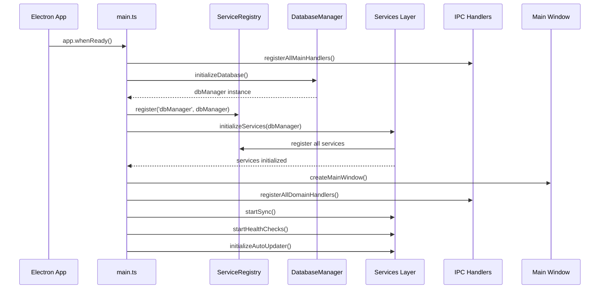
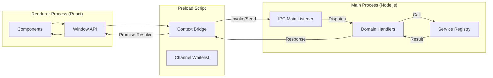
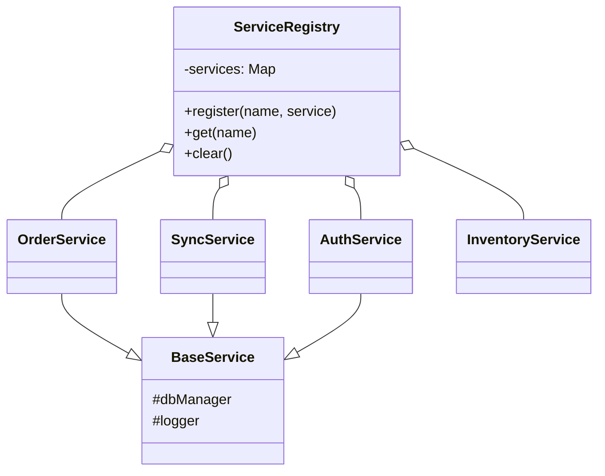
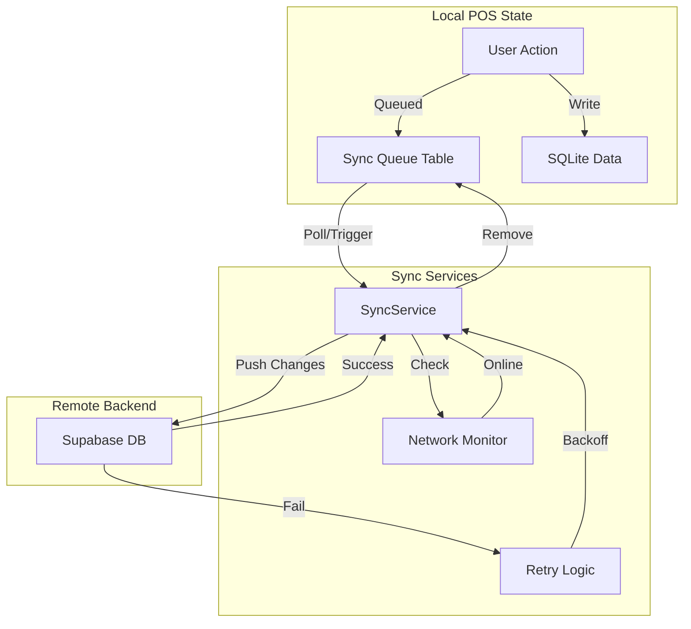
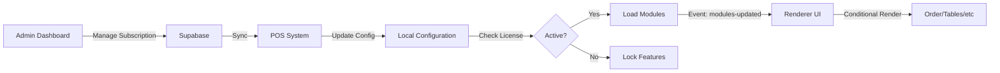
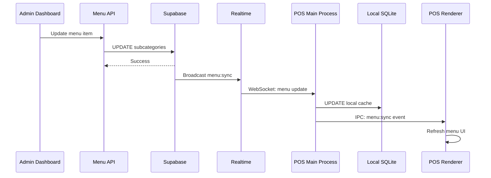
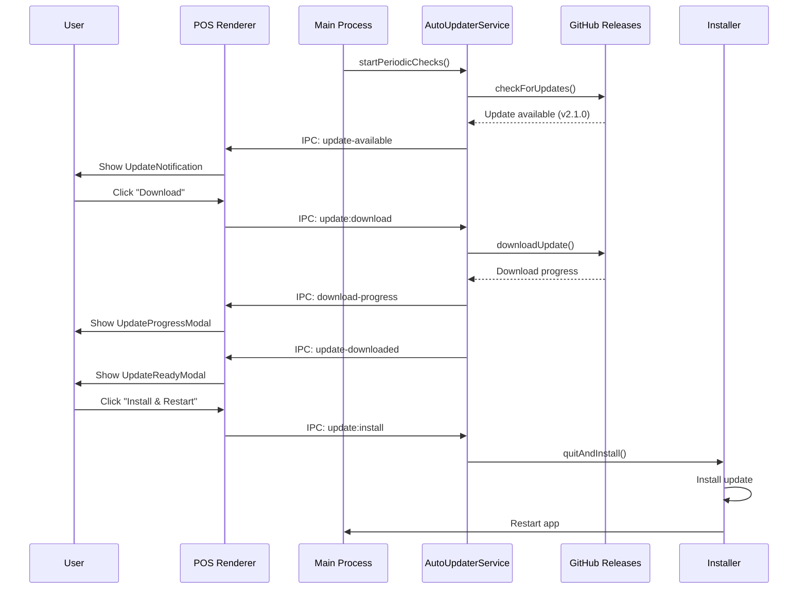

# POS System Architecture

This document details the architecture of the Electron-based POS system, focusing on process communication, service management, synchronization, and updates.

## Main Process Initialization Flow

The application startup sequence coordinates the initialization of database, services, and IPC handlers before creating the main window.

## IPC Communication Architecture

The system uses a secure context-bridge pattern to expose Main process capabilities to the Renderer process.

## Service Registry Pattern

The application uses a Service Registry pattern for dependency injection and singleton management.

## Sync Architecture

The system employs a robust offline-first synchronization strategy.

## Module Integration Flow

Modules are dynamically enabled based on the organization's subscription status (Trial vs Active). The POS verifies the license status before loading module features.

## Database Schema Overview

The local SQLite database mirrors key Supabase tables for offline functionality.

| Table Category | Key Tables |
|----------------|------------|
| **Core** | `users`, `settings`, `sync_queue` |
| **Catalog** | `categories`, `products`, `variations`, `modifiers` |
| **Operations** | `orders`, `order_items`, `payments`, `shifts` |
| **Customers** | `customers`, `addresses` |

## Handler Organization

IPC Handlers are organized by domain to maintain separation of concerns.

| Domain | Handler File | Responsibility |
|--------|--------------|----------------|
| **Auth** | `auth-handlers.ts` | Login, pin verification, user sessions |
| **Orders** | `order-handlers.ts` | Creation, modification, status updates |
| **Menu** | `menu-handlers.ts` | Product fetching, stock updates |
| **Sync** | `sync-handlers.ts` | Manual sync, status checks |
| **System** | `system-handlers.ts` | Hardware, app info, printing |

## Sequence Diagrams

### Menu Sync Flow

### OTA Update Flow

