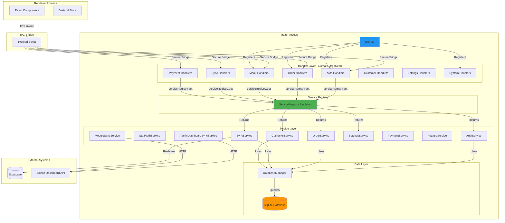
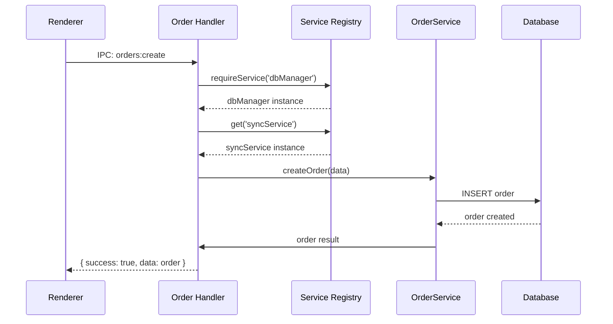

# POS System Refactored Architecture

> **Note:** For comprehensive architecture diagrams and detailed flows (Main Process, IPC, Sync, etc.), see [POS System Architecture](./ARCHITECTURE.md).

This document describes the refactored architecture of the POS system's main process, focusing on the organization of IPC handlers, services, and their interactions.

## Architecture Overview

The POS system follows a **layered architecture** with clear separation of concerns:



## Service Layer

### Service Organization

All services are now located in `src/main/services/`:

| Service | File | Description |
|---------|------|-------------|
| AuthService | `AuthService.ts` | Local PIN-based authentication |
| StaffAuthService | `StaffAuthService.ts` | Staff authentication with Supabase |
| SyncService | `SyncService.ts` | Supabase synchronization |
| AdminDashboardSyncService | `AdminDashboardSyncService.ts` | Admin dashboard sync |
| OrderService | `OrderService.ts` | Order business logic |
| CustomerService | `CustomerService.ts` | Customer management |
| SettingsService | `SettingsService.ts` | Settings management |
| PaymentService | `PaymentService.ts` | Payment processing |
| FeatureService | `FeatureService.ts` | Feature flags |
| ModuleSyncService | `ModuleSyncService.ts` | Module synchronization |
| PrintService | `PrintService.ts` | Print operations |
| ReportService | `ReportService.ts` | Report generation |
| AutoUpdaterService | `auto-updater.ts` | OTA updates management |

### Service Registry Pattern

Services are accessed through a centralized singleton:

```typescript
import { serviceRegistry } from './service-registry';

// Get service (may be null)
const authService = serviceRegistry.get('authService');

// Get required service (throws if not registered)
const dbManager = serviceRegistry.requireService('dbManager');

// Check service status
const status = serviceRegistry.getServiceStatus();
```

## Handler Layer

### Domain-Based Handler Organization

Handlers are organized by business domain under `src/main/handlers/`:

```
handlers/
├── auth/
│   ├── auth-handlers.ts          # Local auth handlers
│   ├── staff-auth-handlers.ts    # Staff auth handlers
│   └── index.ts                  # Auth exports
├── orders/
│   ├── order-crud-handlers.ts    # Order CRUD
│   ├── order-status-handlers.ts  # Status updates
│   ├── order-workflow-handlers.ts # Workflow operations
│   ├── order-retry-handlers.ts   # Retry queue
│   └── index.ts                  # Order exports
├── utils/
│   ├── error-handler.ts          # Error handling utility
│   └── index.ts                  # Utils exports
├── index.ts                      # Main exports
└── ... (existing handlers)
```

### Handler Organization Table

| Domain | Handler File | IPC Channels | Services Used |
|--------|-------------|--------------|---------------|
| **Authentication** | `handlers/auth/auth-handlers.ts` | `auth:login`, `auth:logout`, `auth:get-current-session`, `auth:validate-session`, `auth:has-permission` | AuthService, TerminalConfigService, SettingsService |
| **Staff Auth** | `handlers/auth/staff-auth-handlers.ts` | `staff-auth:*` | StaffAuthService |
| **Orders CRUD** | `handlers/orders/order-crud-handlers.ts` | `order:get-all`, `order:get-by-id`, `order:create`, `order:delete` | DatabaseManager, SyncService, AuthService |
| **Orders Status** | `handlers/orders/order-status-handlers.ts` | `order:update-status`, `order:update-type`, `order:approve`, `order:decline` | DatabaseManager, SyncService, AuthService, StaffAuthService |
| **Orders Workflow** | `handlers/orders/order-workflow-handlers.ts` | `order:assign-driver`, `order:notify-platform-ready`, `payment:update-payment-status` | DatabaseManager, SyncService, SettingsService |
| **Orders Retry** | `handlers/orders/order-retry-handlers.ts` | `order:save-for-retry`, `order:get-retry-queue`, `order:process-retry-queue` | DatabaseManager |
| **Order Preparation** | `handlers/orders/order-preparation-handlers.ts` | `order:update-preparation` | DatabaseManager, AuthService, StaffAuthService |
| **Order Conflict** | `handlers/orders/order-conflict-handlers.ts` | `orders:get-conflicts`, `orders:resolve-conflict`, `orders:force-sync-retry` | DatabaseManager |
| **Menu** | `handlers/menu/menu-handlers.ts` | `menu:get-categories`, `menu:get-subcategories`, `menu:get-ingredients`, `menu:update-*` | MainWindow |
| **Print** | `handlers/print/print-handlers.ts` | `shift:print-checkout`, `printer:test-print` | PrintService, PrinterManager, DatabaseManager |
| **Customers** | `handlers/customers/customer-handlers.ts` | `customer:search`, `customer:create`, `customer:update`, `customer:invalidate-cache` | CustomerService, MainWindow |
| **Settings** | `handlers/settings/settings-handlers.ts` | `get-settings`, `update-settings`, `settings:*`, `terminal-config:*` | SettingsService, TerminalConfigService, AdminDashboardSyncService, SyncService, DatabaseManager |
| **Sync** | `handlers/sync/admin-sync-handlers.ts` | `sync:get-status`, `sync:force`, `sync:fetch-tables`, `sync:fetch-reservations`, `sync:get-financial-stats` | SyncService, AuthService, DatabaseManager |

## Error Handling

### Standardized Error Response Format

All IPC handlers use a consistent response format:

```typescript
interface IPCResponse<T = any> {
  success: boolean;
  data?: T;
  error?: string;
  code?: string;
}
```

### Error Handler Utility

Use the `handleIPCError` wrapper for consistent error handling:

```typescript
import { handleIPCError, IPCResponse } from '../utils';

ipcMain.handle('order:create', async (_event, data) => {
  return handleIPCError(async () => {
    const order = await orderService.create(data);
    return order;
  }, 'order:create');
});
```

### Error Codes

```typescript
const ErrorCodes = {
  UNKNOWN_ERROR: 'UNKNOWN_ERROR',
  PERMISSION_DENIED: 'PERMISSION_DENIED',
  NOT_FOUND: 'NOT_FOUND',
  VALIDATION_ERROR: 'VALIDATION_ERROR',
  DATABASE_ERROR: 'DATABASE_ERROR',
  NETWORK_ERROR: 'NETWORK_ERROR',
  SERVICE_UNAVAILABLE: 'SERVICE_UNAVAILABLE',
  TIMEOUT: 'TIMEOUT',
  CONFLICT: 'CONFLICT',
};
```

## Data Flow

### Request/Response Flow



## Migration Guide

### Adding a New Handler

1. Create handler file in appropriate domain directory:
   ```typescript
   // handlers/myDomain/my-handlers.ts
   import { ipcMain } from 'electron';
   import { serviceRegistry } from '../../service-registry';
   import { handleIPCError } from '../utils';

   export function registerMyHandlers(): void {
     ipcMain.handle('my:action', async (_event, data) => {
       return handleIPCError(async () => {
         const service = serviceRegistry.requireService('myService');
         return await service.doSomething(data);
       }, 'my:action');
     });
   }
   ```

2. Export from domain index:
   ```typescript
   // handlers/myDomain/index.ts
   export { registerMyHandlers } from './my-handlers';
   ```

3. Register in main handlers index:
   ```typescript
   // handlers/index.ts
   import { registerMyHandlers } from './myDomain';

   export function registerAllDomainHandlers(): void {
     // ...
     registerMyHandlers();
   }
   ```

### Adding a New Service

1. Create service in `services/` directory:
   ```typescript
   // services/MyService.ts
   export class MyService {
     constructor(private db: DatabaseManager) {}

     async doSomething(data: any) {
       // implementation
     }
   }
   ```

2. Add to ServiceInstances interface in `service-registry.ts`

3. Register during initialization:
   ```typescript
   serviceRegistry.register('myService', new MyService(dbManager));
   ```

4. Export from services index:
   ```typescript
   // services/index.ts
   export { MyService } from './MyService';
   ```

## Testing Strategy

### Unit Testing

- Test handlers in isolation with mocked serviceRegistry
- Test services with mocked database
- Use standardized error response format for assertions

### Integration Testing

- Test complete IPC flow from handler to database
- Verify service registration order
- Test error handling scenarios

### Test Example

```typescript
describe('Order CRUD Handlers', () => {
  beforeEach(() => {
    // Mock serviceRegistry
    jest.spyOn(serviceRegistry, 'requireService').mockReturnValue(mockDbManager);
  });

  it('should create order successfully', async () => {
    const result = await ipcMain.handle('order:create', mockEvent, { orderData });

    expect(result.success).toBe(true);
    expect(result.data).toHaveProperty('id');
  });

  it('should return error for invalid data', async () => {
    const result = await ipcMain.handle('order:create', mockEvent, { orderData: {} });

    expect(result.success).toBe(false);
    expect(result.error).toBeDefined();
  });
});
```

## Best Practices

1. **Always use serviceRegistry** - Never pass services as handler dependencies
2. **Use requireService** for mandatory services - Fail fast if service is missing
3. **Use handleIPCError** - Consistent error handling across all handlers
4. **Remove handlers before registration** - Prevent double-registration errors
5. **Log context** - Include handler name in logs for debugging
6. **Transform data** - Always transform DB format to frontend format in handlers

## Related Documentation

- **[POS System Architecture](./ARCHITECTURE.md)** - Comprehensive diagrams and flows
- **[System-Wide Architecture](../../../docs/ARCHITECTURE_OVERVIEW.md)** - High-level component overview
