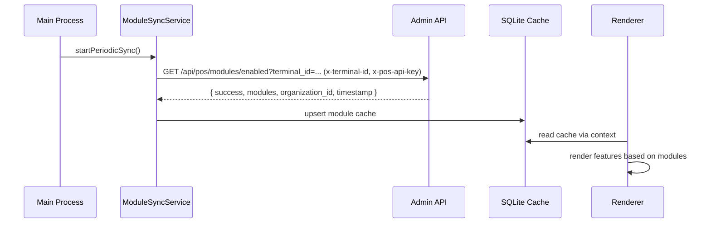

# Module Integration Guide (POS System)

Overview

How POS loads purchased modules and gates UI dynamically. Covers ModuleSyncService, local caching, the useAcquiredModules hook, and testing.

Last Updated: 2025-12-08

---

Table of Contents

1. Overview and Data Flow
2. ModuleSyncService (main process)
3. useAcquiredModules (renderer)
4. Conditional UI Patterns
5. Error Handling and Retries
6. Testing Combinations
7. Related Docs

---

1. Overview and Data Flow

- POS fetches enabled modules from Admin API GET /api/pos/modules/enabled using headers x-terminal-id and x-pos-api-key and query param terminal_id.
- Response is cached in SQLite for offline use; renderer consumes via ModuleContext and useAcquiredModules.

Sequence:



2. ModuleSyncService (main process)

- Fetch interval default 2 minutes; timeout 30s.
- Notifies renderer on success/errors; falls back to cache on failures.

Example (from src/main/services/ModuleSyncService.ts):

```ts
const url = `${adminDashboardUrl}/api/pos/modules/enabled?terminal_id=${terminalId}`
const res = await fetch(url, { headers: { 'x-terminal-id': terminalId, 'x-pos-api-key': apiKey } })
if (!res.ok) /* handle 401/404/5xx */
const data = await res.json() // { success, modules, organization_id, terminal_id, timestamp }
```

3. useAcquiredModules (renderer)

- Wraps ModuleContext and exposes hasModule plus common flags.
- Refetch combines local refresh and admin sync.

Example:

```tsx
import { useAcquiredModules, MODULE_IDS } from '../../src/renderer/hooks/useAcquiredModules'

export function OrderTypeSelector() {
  const { hasModule } = useAcquiredModules()
  return (
    <div>
      <button>Pickup</button>
      {hasModule(MODULE_IDS.TABLES) && <button>Dine-in</button>}
      {hasModule(MODULE_IDS.DELIVERY) && <button>Delivery</button>}
      {hasModule(MODULE_IDS.ROOMS) && <button>Room Service</button>}
    </div>
  )
}
```

4. Conditional UI Patterns

- Navigation: filter items by hasModule.
- Screens/routes: prevent access when module disabled.
- Feature flags: combine with module checks for staged releases.

5. Error Handling and Retries

- 401: invalid terminal credentials → prompt for reconfiguration.
- 404: terminal not found → ensure terminal registration.
- Network/timeout: keep using cached modules; show banner.

6. Testing Combinations

- Seed local cache with sets of modules and assert UI gating.
- Mock fetch to /api/pos/modules/enabled to simulate auth errors and 5xx.
- Property-based tests for combinations (see pos-system/src/tests/module-sync-service.property.test.ts).

7. Related Docs

- docs/13-MODULE-SYSTEM.md
- docs/14-INTEGRATION-ARCHITECTURE.md
- pos-system/docs/architecture/01-OVERVIEW.md
